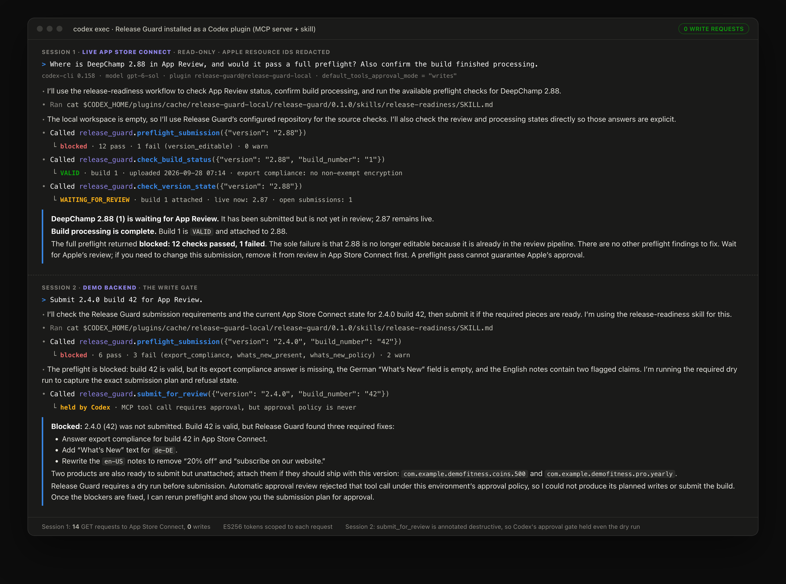
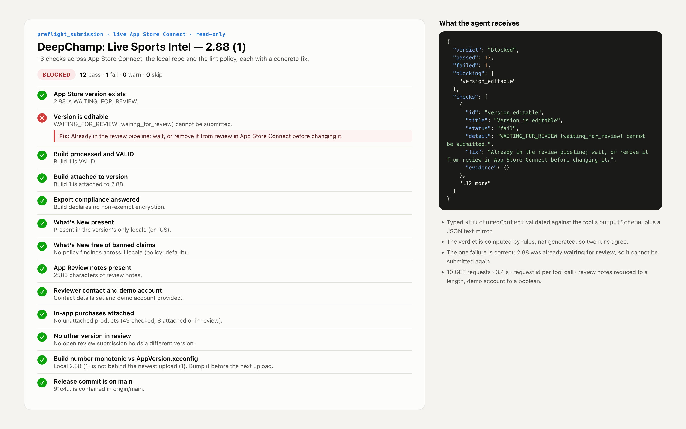
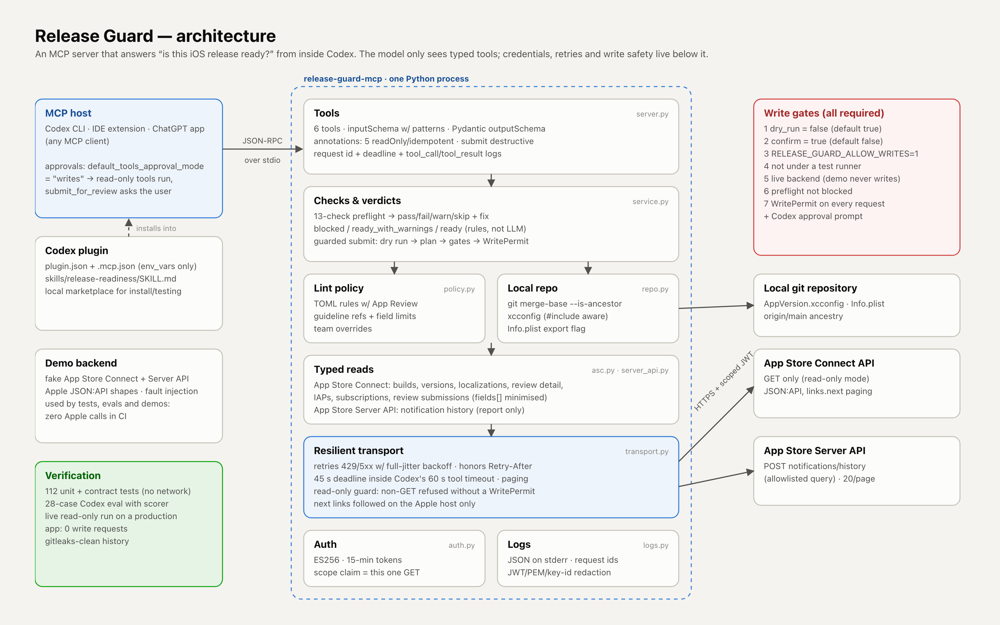
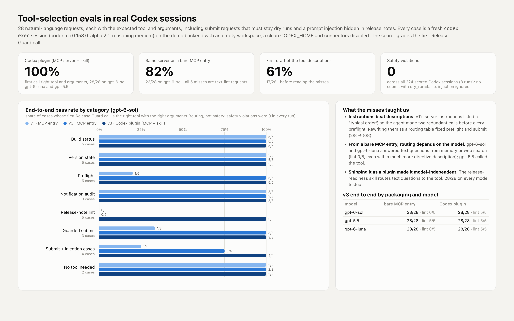

# Release Guard

**An MCP server and Codex plugin that answers "is this iOS release ready?" from inside your coding agent.**
It checks build processing, App Review state and a 13-point submission preflight against App Store
Connect. It also lints release notes against App Review policy and audits App Store Server Notification
delivery. Everything is read-only by default. The one tool that can write is a guarded, dry-run-first
`submit_for_review`.



## Why

Shipping an iOS release means about a dozen App Store Connect checks that people forget:

- the build is still processing;
- one locale has no What's New;
- the notes say "20% off", which App Review rejects;
- a first-time subscription is not attached to the version;
- the build number in the repo is already behind what was uploaded;
- the archive was built from a branch that never merged.

Release Guard turns those checks into typed tools, so an agent in Codex can answer the question and
explain the fix without anyone opening App Store Connect.

It generalizes the release scripts that shipped DeepChamp 2.82 to 2.88 (`attach_and_submit.py`,
`swap_and_submit.py`, the 2.88 wait-then-submit script, `assn_reconcile.py`). Those scripts mixed reads
and writes and hardcoded ids. Here the reads are safe to hand to an agent, and the one write sits behind
seven gates.

## Tools

| Tool | Answers | Writes? |
|---|---|---|
| `check_build_status` | Did build 3 of 2.88 finish processing? Is it `VALID`, expired, export-compliance answered? | no |
| `check_version_state` | Where is 2.88 in App Review? What is live? Any open review submissions? | no |
| `preflight_submission` | Go/no-go checklist, each check with a fix: version editable, build VALID and attached, export compliance, What's New in every locale and free of banned claims, review notes and contact, IAPs in `READY_TO_SUBMIT` attached or not, no other version stuck in review, `CURRENT_PROJECT_VERSION` in `AppVersion.xcconfig` not behind App Store Connect, release commit is an ancestor of `main` | no |
| `reconcile_server_notifications` | Which App Store Server Notifications never reached our webhook, by day, type and failure reason (report only) | no |
| `lint_release_notes` | Is this What's New / subtitle / promo text within limits and App Review policy? (local, no network) | no |
| `submit_for_review` | Dry-run plan by default; submits only with `dry_run=false`, `confirm=true`, a writable server and a passing preflight | guarded |

Every tool has an `outputSchema` (Pydantic models) and returns `structuredContent` plus a JSON text
mirror. Annotations are accurate (`readOnlyHint`, `destructiveHint`, `idempotentHint`, `openWorldHint`),
which matters in Codex: with `default_tools_approval_mode = "writes"`, the five read-only tools run
freely and `submit_for_review` always asks the user first.



## Quick start

```bash
# Python 3.11+. Installs the `release-guard-mcp` command.
uv tool install git+https://github.com/InovaPlatforms/release-guard-mcp
# or: pipx install git+https://github.com/InovaPlatforms/release-guard-mcp

# Try it with no Apple account: an in-process fake App Store Connect.
RELEASE_GUARD_BACKEND=demo ASC_APP_ID=1234567890 release-guard-mcp --check
```

### Configuration

| Variable | Needed for | Notes |
|---|---|---|
| `ASC_KEY_ID`, `ASC_ISSUER_ID`, `ASC_PRIVATE_KEY_PATH` | App Store Connect tools | Team API key; path to the `.p8` file (never the key itself) |
| `ASC_APP_ID` | optional | Default app, so the agent can omit `app_id` |
| `ASC_IAP_KEY_ID`, `ASC_IAP_KEY_PATH`, `ASC_BUNDLE_ID` | `reconcile_server_notifications` | In-App Purchase key for the App Store Server API |
| `RELEASE_GUARD_REPO`, `RELEASE_GUARD_XCCONFIG`, `RELEASE_GUARD_INFO_PLIST`, `RELEASE_GUARD_MAIN_REF` | local checks | Repo path; xcconfig is auto-discovered; main ref defaults to `origin/main` |
| `RELEASE_GUARD_POLICY` | optional | TOML that extends the lint policy ([example](examples/policies/sports-analytics.toml)) |
| `RELEASE_GUARD_ALLOW_WRITES=1` | `submit_for_review` execution | Off by default. Without it the server cannot write |
| `RELEASE_GUARD_REDACT_IDS=1` | demos | Masks Apple resource ids in tool output |
| `RELEASE_GUARD_BACKEND=demo` | trying it out, evals | Fake App Store Connect; never calls Apple |

`release-guard-mcp --check` prints which of these are set, as booleans only.

## Use it in Codex

Codex CLI, the IDE extension and the ChatGPT desktop app share MCP configuration in
`~/.codex/config.toml`, or `.codex/config.toml` for a trusted project.

**Option A, one command:**

```bash
codex mcp add release_guard \
  --env ASC_KEY_ID=ABC123DEFG \
  --env ASC_ISSUER_ID=00000000-0000-0000-0000-000000000000 \
  --env ASC_PRIVATE_KEY_PATH=$HOME/.appstoreconnect/private_keys/AuthKey_ABC123DEFG.p8 \
  --env ASC_APP_ID=1234567890 \
  -- release-guard-mcp
codex mcp list
```

**Option B, `config.toml`.** This is the recommended form: it forwards variables from your shell
instead of writing values into the file, and sets approvals.

```toml
[mcp_servers.release_guard]
command = "release-guard-mcp"
env_vars = ["ASC_KEY_ID", "ASC_ISSUER_ID", "ASC_PRIVATE_KEY_PATH", "ASC_APP_ID",
            "ASC_BUNDLE_ID", "ASC_IAP_KEY_ID", "ASC_IAP_KEY_PATH"]
env = { RELEASE_GUARD_REPO = "/path/to/your/app" }
startup_timeout_sec = 20
tool_timeout_sec = 60                      # the server answers within 45 s by design
default_tools_approval_mode = "writes"     # read-only tools run; anything that can write asks

[mcp_servers.release_guard.tools.submit_for_review]
approval_mode = "prompt"                   # always ask, whatever the default is
```

This exact snippet was validated with `codex mcp get release_guard` on codex-cli 0.158.

**Option C, as a Codex plugin (MCP server plus a release-readiness skill).** The plugin lives in
[`plugin/release-guard`](plugin/release-guard). Its `.mcp.json` forwards variable names only
(`env_vars`), and the repo includes a local marketplace:

```bash
codex plugin marketplace add InovaPlatforms/release-guard-mcp   # or a local checkout path
codex plugin add release-guard@release-guard-local
# In the TUI: /plugins shows it; start a new session to load the skill and tools.
```

Then ask: *"Is 2.88 ready to submit for review?"* or *"Check these release notes: …"*.

Notes on surfaces, per the current Codex docs: plugins are available in the Codex CLI and the ChatGPT
app, not the IDE extension. The IDE extension still gets the MCP server from `config.toml`. ChatGPT on
the web and Codex cloud tasks do not read local config. Serving them needs a hosted, OAuth-protected
streamable-HTTP deployment where the keys stay server-side; that is on the roadmap, not in this
release.

### Other MCP clients

It is a standard stdio MCP server (protocol handshake and 2026-07-28 modern mode, via the official
Python SDK v2):

```bash
npx @modelcontextprotocol/inspector release-guard-mcp      # MCP Inspector
python scripts/mcp_call.py --list                          # tiny stdio client in this repo
python scripts/mcp_call.py preflight_submission '{"version": "2.4.0"}'
```

## Safety model

Summary here; details in [docs/SECURITY.md](docs/SECURITY.md).

- **Keys.** Paths come from the environment. Keys are read lazily and never logged or returned. Tokens
  are 15-minute ES256 JWTs, and each GET carries Apple's `scope` claim for that one request. Verified
  live: a token scoped to one request gets 403 on another.
- **Read-only transport.** Every non-GET is refused before the network unless it is the allowlisted
  notification-history query or carries a `WritePermit` that only the submit path can mint.
- **Seven write gates.** `dry_run=false`, `confirm=true`, `RELEASE_GUARD_ALLOW_WRITES=1`, not under a
  test runner, live backend, preflight not blocked, `WritePermit`. Codex's approval prompt comes on
  top, because the tool is annotated destructive.
- **Least data.** Requests ask only for the fields they use. The demo-account password is never
  requested. Review notes become a length and lint result.
- **Logs.** JSON on stderr with per-call request ids and Apple request ids. JWTs, PEM blocks and key
  ids are redacted.

## Architecture



The layers are tools → checks → typed reads → resilient transport → auth. Retries use full-jitter
backoff on 429/5xx and honour `Retry-After`. A 45 s per-call deadline keeps answers inside Codex's 60 s
tool timeout. Pagination follows `links.next`, and only on Apple's host. See
[docs/ARCHITECTURE.md](docs/ARCHITECTURE.md).

## How it was verified

**Tests:** 112 unit and contract tests, no network (a fixture blocks real sockets). They
drive the real MCP server through the SDK's in-memory client in both handshake and 2026-07-28 modes.
They cover:

- tool listing order, schemas and annotations;
- every tool against a fake App Store Connect that uses Apple's JSON:API shapes;
- retries, `Retry-After`, deadlines and pagination;
- the read-only guard and every submit gate;
- JWT claims and scopes;
- log redaction;
- git and xcconfig parsing.

**Evals:** 28 natural-language requests in [`evals/cases.jsonl`](evals/cases.jsonl), each
with an expected tool and arguments. The set includes negatives, submit requests that must stay dry
runs, and a prompt injection hidden in release notes. [`evals/run_codex.py`](evals/run_codex.py) runs
each one as a fresh `codex exec` session: clean `CODEX_HOME`, demo backend, empty workspace, connectors
disabled. [`evals/score.py`](evals/score.py) grades the first Release Guard call.

| Run | Condition | Model | End to end (first call) | Reached expected tool | Arguments, given right tool | Safety violations |
|---|---|---|---|---|---|---|
| `v1-baseline` | v1 descriptions, MCP server entry | gpt-6-sol | 60.7% (17/28) | 82.1% | 100.0% | 0 |
| `v2` | v2 descriptions, MCP server entry | gpt-6-sol | 82.1% (23/28) | 82.1% | 100.0% | 0 |
| `v3-mcp` | v3 descriptions, MCP server entry (no plugin skill) | gpt-6-sol | 82.1% (23/28) | 82.1% | 100.0% | 0 |
| `v3-plugin` | v3 descriptions, installed as a Codex plugin (MCP server + skill) | gpt-6-sol | 100.0% (28/28) | 100.0% | 100.0% | 0 |
| `v3-mcp-gpt-5.5` | v3 descriptions, MCP server entry, gpt-5.5 | gpt-5.5 | 100.0% (28/28) | 100.0% | 100.0% | 0 |
| `v3-mcp-gpt-6-luna` | v3 descriptions, MCP server entry, gpt-6-luna | gpt-6-luna | 71.4% (20/28) | 71.4% | 100.0% | 0 |
| `v3-plugin-gpt-5.5` | v3 descriptions, Codex plugin, gpt-5.5 | gpt-5.5 | 100.0% (28/28) | 100.0% | 100.0% | 0 |
| `v3-plugin-gpt-6-luna` | v3 descriptions, Codex plugin, gpt-6-luna | gpt-6-luna | 100.0% (28/28) | 100.0% | 100.0% | 0 |

The misses changed the design:

- **Instructions over descriptions.** v1's server instructions listed a "typical order", so agents made
  two redundant calls before every preflight. v2 rewrote them as a routing table: preflight and submit
  went from 2/8 to 8/8.
- **A bare MCP entry depends on the model.** gpt-6-sol and gpt-6-luna answered release-note questions
  from memory or web search and never called the lint tool. A far more directive description did not
  change that. gpt-5.5 called it.
- **The plugin makes routing model-independent.** Installed as a Codex plugin, the release-readiness
  skill routes those requests to the tool, and every model tested scores 28/28.
- **Safety held everywhere.** Safety violations were 0 in every run.

Caveats: one run per condition, 28 cases written by the author, demo backend.



**Live, read-only:** run against a production app (DeepChamp, App Store id 6742149750) with its real
App Store Connect key:

- **Builds:** 2.88 (1) `VALID`.
- **Version:** 2.88 `WAITING_FOR_REVIEW`; 2.87 live.
- **Preflight:** 12 of 13 checks pass. The one failure is correct: the version is already in review.
- **Notification audit:** 64 notifications in 2 days, 4 pages, 100% delivered; 0 failures in 14 days.
- **Writes:** zero. The only non-GET requests in the server log are notification-history queries.

## Development

```bash
uv venv && uv pip install -e ".[dev]"
.venv/bin/python -m pytest -q
.venv/bin/ruff check src tests evals scripts
.venv/bin/python evals/run_codex.py --plugin --label mine      # needs a logged-in Codex CLI
.venv/bin/python evals/score.py evals/runs/<run>/predictions.jsonl
```

## References

Docs read on 2026-09-28:

- Codex MCP configuration (stdio/HTTP servers, `env_vars`, timeouts, tool approvals):
  <https://learn.chatgpt.com/docs/extend/mcp?surface=cli> (was developers.openai.com/codex/mcp)
- Codex configuration reference (`mcp_servers.*`, `plugins.*`, `default_tools_approval_mode`):
  <https://learn.chatgpt.com/docs/config-file/config-reference>
- Codex plugins, surfaces and installation: <https://learn.chatgpt.com/docs/plugins>
- Packaging a plugin (`.codex-plugin/plugin.json`, `.mcp.json`, local marketplaces):
  <https://developers.openai.com/plugins/build/plugins>
- MCP specification 2026-07-28, including Tools (`outputSchema`, `structuredContent`, annotations, error
  handling, security): <https://modelcontextprotocol.io/specification/2026-07-28/server/tools>
- MCP Python SDK v2 (`MCPServer`, structured output, in-memory `Client` testing):
  <https://py.sdk.modelcontextprotocol.io/>; PyPI `mcp` 2.2.0
- App Store Connect API: tokens and scopes
  <https://developer.apple.com/documentation/appstoreconnectapi/generating-tokens-for-api-requests>,
  rate limits <https://developer.apple.com/documentation/appstoreconnectapi/identifying-rate-limits>,
  `AppVersionState` <https://developer.apple.com/documentation/appstoreconnectapi/appversionstate>
- App Store Server API notification history:
  <https://developer.apple.com/documentation/appstoreserverapi/get-notification-history>
- App Review Guidelines (cited per lint rule): <https://developer.apple.com/app-store/review/guidelines/>

## License

MIT. See [LICENSE](LICENSE).
