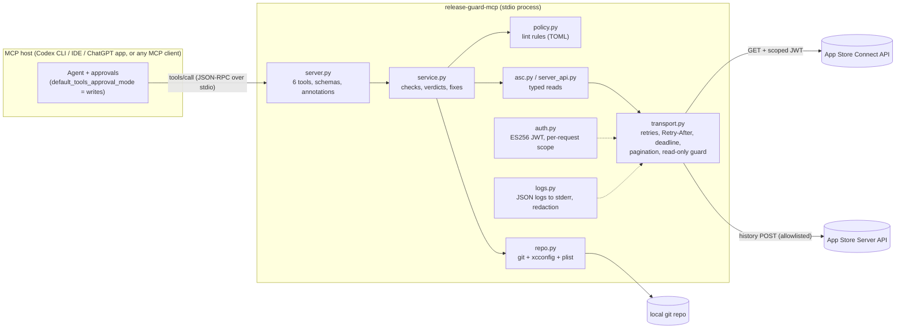

# Architecture

Release Guard is a small, layered MCP server. The agent sees six typed tools; the
layers underneath keep Apple credentials, retries and safety rules out of the
model's hands.

## Request path

1. **MCP layer (`server.py`).** `MCPServer` from the official Python SDK (v2) turns
   each tool function into a tool definition: the signature becomes `inputSchema`
   (with regex patterns for versions and build numbers), the Pydantic return type
   becomes `outputSchema`, and results carry both `structuredContent` and a JSON text
   mirror, as the 2026-07-28 spec recommends. Every call gets a request id
   (`rg-xxxxxxxxxx`), a deadline, and `tool_call` / `tool_result` log events.
   Anticipated failures become `ToolError`s (`isError: true`) whose text tells the
   model what to do next, e.g. which environment variable is missing, or how long
   Apple asked it to wait.
2. **Service layer (`service.py`).** Plain async Python with no MCP dependency, so
   every check is unit-testable. `preflight_submission` composes 13 checks. Each
   returns `pass | fail | warn | skip` plus a concrete fix, and the report verdict
   is derived: any fail makes it `blocked`, any warn makes it `ready_with_warnings`.
   A permission error on one section (e.g. a key without access to in-app
   purchases) becomes a `skip` for that check instead of failing the whole preflight.
3. **Domain clients (`asc.py`, `server_api.py`).** Typed reads that request only the
   fields they need (`fields[builds]=version,processingState,…`). Review details are
   fetched without the demo-account password. The review notes body is reduced to a
   length and lint result before it leaves the module.
4. **Transport (`transport.py`).** One `httpx.AsyncClient` per API with:
   - retries on 429, 5xx and transport errors, exponential backoff with full jitter;
   - `Retry-After` in seconds or HTTP-date. A wait longer than 20 s becomes an
     immediate, actionable error instead of a hung tool;
   - a per-tool-call deadline (default 45 s) that fits inside Codex's default 60 s
     `tool_timeout_sec`;
   - `X-Rate-Limit` parsing with a low-budget warning. The header was absent on the
     endpoints used during live verification, so 429 handling is the main defence;
   - a concurrency cap (4) to stay under Apple's per-minute throttling;
   - JSON:API `links.next` pagination and App Store Server API `paginationToken`
     paging, both bounded by `max_pages`, and next links are only followed on the
     configured host, so a bearer token is never sent to a URL a response supplied;
   - the **read-only guard**: every non-GET request is refused unless it is the one
     allowlisted query POST (`/inApps/v1/notifications/history`) or carries a
     `WritePermit`, a token only the guarded submit path can mint.
5. **Auth (`auth.py`).** ES256 JWTs minted from a `.p8` path in the environment:
   15-minute lifetime (Apple's ceiling is 20), cached per scope, refreshed 60 s early.
   GET tokens carry Apple's `scope` claim for the exact request, so a token is useless
   for any other call. Live verification confirmed a token scoped to one request
   gets 403 on another. The App Store Server API uses a separate In-App Purchase key
   with the `bid` claim.
6. **Local checks (`repo.py`).** `git merge-base --is-ancestor` (no shell, 10 s
   timeout, revisions validated so they can never become git options), an xcconfig
   parser that follows `#include` like Xcode, and a plist reader for
   `ITSAppUsesNonExemptEncryption`.

## Tools

| Tool | Reads | Annotations |
|---|---|---|
| `check_build_status` | `GET /v1/builds` | readOnly, idempotent, openWorld |
| `check_version_state` | apps, appStoreVersions (+build), reviewSubmissions | readOnly, idempotent, openWorld |
| `preflight_submission` | versions, builds, localizations, reviewDetail, IAPs, subscriptions, reviewSubmissions (+items), git, xcconfig, plist | readOnly, idempotent, openWorld |
| `reconcile_server_notifications` | `POST /inApps/v1/notifications/history` (query) | readOnly, idempotent, openWorld |
| `lint_release_notes` | nothing (local) | readOnly, idempotent, closed world |
| `submit_for_review` | preflight + plan; writes only when every gate passes | destructive, not idempotent |

The annotations do real work in Codex. With `default_tools_approval_mode = "writes"`,
Codex runs the five read-only tools without prompting and asks the user before
`submit_for_review`.

## Tool design choices

- **Six tools, not one per endpoint.** Each tool matches a question a release
  manager asks ("did it process?", "where is it?", "can I submit?"). The model
  picks from intent, and the checklist logic lives in code, not in the prompt.
- **Descriptions route between siblings.** Each description says when to use the
  tool *and* which sibling to use instead (build processing vs review state vs
  full preflight). The contract tests assert these cross-references exist, and the
  eval set measures the routing.
- **Outputs are typed for the next step.** Every report carries a `next_step` or
  per-check `fix`, so the agent can act without extra calls. Output schemas
  include field descriptions written for the model.
- **Verdicts are computed, not generated.** `blocked / ready_with_warnings / ready`
  comes from deterministic rules, so two runs agree and tests can pin behaviour.
- **Policy is data.** Lint rules live in TOML with the App Review guideline each one
  protects. Teams extend or disable rules without code (`examples/policies/`).

## Backends

`RELEASE_GUARD_BACKEND=live` (default) calls Apple. `RELEASE_GUARD_BACKEND=demo`
serves a fake App Store Connect and App Store Server API in-process
(`fake_asc.py`). The fake uses Apple's JSON:API shapes, supports pagination,
filters and fault injection (429 + Retry-After, 5xx, 403). The test suite, the eval
harness and demos all use it, so none of them call Apple.

## Where this came from

The checks generalize the release scripts used to ship DeepChamp 2.82 to 2.88
(`attach_and_submit.py`, `swap_and_submit.py`, the 2.88 `submit_288.py` wait-then-submit
flow, and `assn_reconcile.py`). Those scripts hardcoded ids, mixed reads and writes,
and relied on a human to read their output. Release Guard keeps their hard-won rules:
only one open review submission per version, `subscriptionSubmissions` for first-time
subscriptions, a banned-word list for What's New, report-only notification audits.
It exposes them as typed, read-only-by-default tools an agent can call safely.
